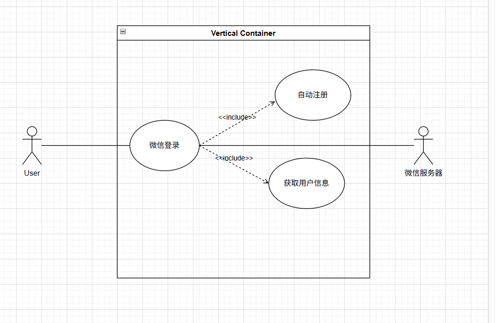
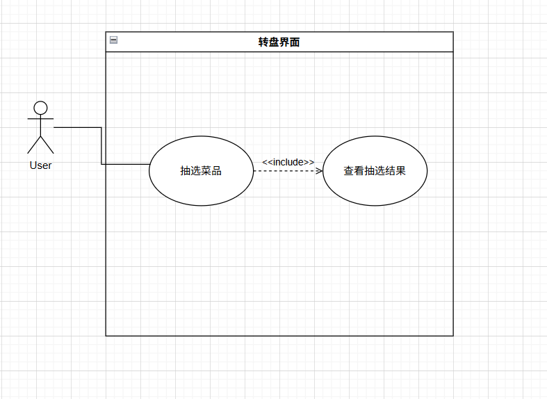
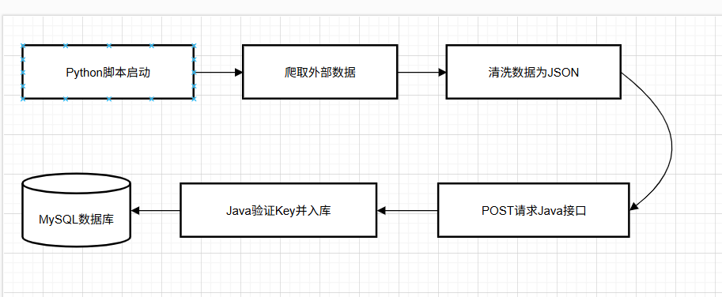

** 饭电项目**

**需求规格说明书**

变更记录

**版本号**

**修改点说明**

**变更日期**

**变更人**

**审批人**

V1.0

创建

修改点说明的内容有如下几种：创建、修改（+修改说明）、删除（+删除说明）

**目录**

[1	引言	1](#_Toc225107635)

[1.1	目的	1](#_Toc225107636)

[1.2	适用范围	1](#_Toc225107637)

[1.3	参考文档	1](#_Toc225107638)

[1.4	名词术语	1](#_Toc225107639)

[2	需求概述	2](#_Toc225107640)

[2.1	产品目标	2](#_Toc225107641)

[2.2	产品范围	2](#_Toc225107642)

[2.3	产品角色	2](#_Toc225107643)

[3	产品约束	2](#_Toc225107644)

[4	接口需求	3](#_Toc225107645)

[5	功能性需求	4](#_Toc225107646)

[5.1	需求列表及优先级	4](#_Toc225107647)

[5.2	公用需求描述	5](#_Toc225107648)

[5.3	用户认证服务	6](#_Toc225107649)

[5.3.1	微信登录需求项	6](#_Toc225107650)

[5.4	智能决策服务	8](#_Toc225107651)

[5.4.1	随机大转盘	9](#_Toc225107652)

[5.5	后台自动化服务	10](#_Toc225107653)

[5.5.1	远程数据采集与入库	11](#_Toc225107654)

[6	非功能性需求	12](#_Toc225107655)

[6.1	用户界面需求	12](#_Toc225107656)

[6.2	产品质量需求	13](#_Toc225107657)

[6.3	其他需求	14](#_Toc225107658)

[7	产品需求确认	15](#_Toc225107659)

# 引言

## 目的

本文档旨在明确“饭电”微信小程序 的功能与非功能需求，作为小组开发成员（Java 后端、Python 爬虫、Uni-app 前端）之间协作的依据，并供指导老师评审。

## 适用范围

用户：在校大学生、教职工。

开发人员： 软件工程课程小组全体成员

设计人员： 负责 UI 界面与原型设计的组员

## 参考文档

*列举编写文档时所参考的资料或其它资源。*

**资料名称**

**出 版 单 位**

**作  者**

**出 版 日  期**

## 名词术语

**术语、缩略语**

**解      释**

Uni-app

跨平台前端开发框架，用于构建 App 界面

Spring Boot

基于 Java 的后端开发框架

爬虫

指使用 Python 编写的自动化数据采集程序

# 需求概述

## 产品目标

目标

期望

解决校园用餐决策焦虑问题

	用户通过“饭电”小程序，在 30 秒内即可通过随机抽选或推荐获得用餐建议，显著减少决策时间

实现跨平台数据自动更新

利用 Python 爬虫技术，每周自动更新一次周边美食数据，保证信息的时效性和准确性。

## 产品范围

包含内容：

- 随机转盘
- 基于 Python 爬虫的周边美食数据自动更新

不包含内容：

- 不涉及在线支付功能
- 不涉及商家注册门店功能

## 产品角色

普通用户：在校学生及教职工，使用频率为每天 2-3 次（餐前）。

系统管理员：小组开发成员，负责审核非法评价、运行 Python 数据同步脚本。

# 产品约束

标准性限制：

- 行业标准：系统需遵循《信息安全技术 个人信息安全规范》（GB/T 35273-2020），确保学生用户的账号信息与评论数据的隐私安全。
- 命名规范：后端 Java 代码遵循阿里巴巴 Java 开发手册标准；前端 JavaScript 遵循 ESLint 代码规范。

技术限制：

- 硬件环境：用户端限制为支持微信小程序的智能手机
- 软件环境：前端：基于 Uni-app 框架，运行环境为微信开发者工具及微信 App。
- 后端：Java JDK 1.8+，Spring Boot 2.x 框架。
- MySQL 8.0。

- 技术约束：由于微信小程序的限制，所有后端接口在正式发布前必须通过 HTTPS 加密通信，且域名需经过备案。

管理限制：

- 交付时间：必须在软件工程概论课程规定的学期末前提交完整源代码、说明书及演示视频。
- 项目资源：本项目为课程作业，预算为 100 元，利用开源社区资源（如 Spring Boot, Vue, Vant UI）进行开发，后端服务器可能需要相关资源
- 沟通方式：小组通过 GitHub进行版本管理，每周进行一次线下进度同步会。

其他限制：

- 维护要求：在验收通过后的 1周内，需保证系统基础抽选功能和数据爬取脚本的可运行性。

# 接口需求

内部接口：

- 前后端交互接口：
- 协议与格式：前端（JavaScript/Uni-app）与后端（Java/Spring Boot）采用 HTTP/HTTPS 协议进行通信，数据交换格式统一使用 JSON。
- 接口范例： GET /api/food/random：前端请求随机菜品，后端返回菜品名称、图片 URL 及价格。
- POST /api/comment/add：前端提交用户评论数据，后端返回处理结果状态。

- 后端内部处理接口：数据库接口：通过 MyBatis 或 JPA 框架实现 Java 对象与 MySQL 数据库的映射交互。

外部接口：

- 用户接口（User Interface）：基于微信小程序原生标准设计的图形界面（GUI），支持手势滑动、点击触发及摇一摇感应。
- 通信接口（Communication Interface）： 微信登录接口：调用微信 OAuth 2.0 接口，通过 wx.login 获取 code，由 Java 后端换取用户的 OpenID 实现免密登录。
- 图片存储接口：系统图片资源通过微信云存储或指定的 OSS 对象存储进行托管，通过 URL 进行外部引用。
- 软件接口（Software Interface）： Python 数据同步接口：Python 爬虫脚本作为外部工具，通过 RESTful API 接口将爬取的周边餐厅数据定期推送到 Java 后端。
- 接口标准：遵循标准 HTTP 状态码（如 200 表示成功，404 表示资源不存在，500 表示服务器错误）。

# 功能性需求

## 需求列表及优先级

编号

需求项名称

简要描述

优先级

FR-01

抽取菜品

支持用户通过大转盘随机获得推荐菜品，解决决策困难。

高

FR-02

微信一键登录

支持微信登录

高

FR-03

数据自动更新

固定时间段更新数据库中的菜品种类

低

## 公用需求描述

1. 统一身份标识 (OpenID) 传递规范

- 应用场景：用户登录、点击抽选。
- 需求描述：用微信 OpenID 作为用户唯一身份凭证。
- 处理逻辑：获取：前端在小程序初始化时调用微信登录，获取并本地缓存 OpenID
- 传递：后续所有业务请求（如随机抽选）均需在 Header 或 URL 参数中携带该 OpenID。
-  校验：后端 Java 接收到 OpenID 后，直接关联数据库中的用户记录，无需二次解密。

2.全局交互反馈 (Feedback) 规范

- 应用场景：所有网络请求环节
- 需求描述：确保用户在操作后能感知到系统正在运行，避免由于网络延迟导致的“界面卡死”假象。
- 处理逻辑：加载提示：前端发起 uni.request 前必须调用 uni.showLoading({title: '寻找能量中...'})。
- 成功/失败提示：请求结束后，必须统一调用 uni.hideLoading()，并根据结果弹出 uni.showToast（如“抽取成功”或“网络波动”）。

3.后端数据返回格式规范 (RESTful JSON)

- 应用场景：Java 与 Uni-app、Java 与 Python 之间的所有通信。
- 需求描述：为了降低前后端联调的沟通成本，所有接口必须返回统一结构的 JSON 数据。
- 处理逻辑：统一响应格式如下：{"code": 200, // 状态码：200成功，500错误

"msg": "操作成功",

"data": { ... } // 具体的菜品信息或用户信息需求类别：智能决策服务

4.HTTPS 通信与合法域名规范

- 应用场景：小程序与服务器交互。
- 需求描述：遵循微信小程序强制性安全约束。
- 处理逻辑：服务器需配置 SSL 证书以启用 HTTPS。在微信公众平台后台将 Java 服务器地址设为“合法域名”，否则真机无法访问。

## 用户认证服务

### 微信登录需求项

#### 用例图

**用例名称**

微信登录

**用例标识**

SR-*AUTH-01* 

**优先级**

高

**使用频率**

高

**用户参与者**

普通用户，微信开放平台

**用例说明**

用于实现登录效果

**前置条件**

用户安装微信并打开饭电小程序

**事件流**

- **基本事件流**

1）用户进入小程序首页，点击登录

2)前端调用uni.login获取临时登录凭证code;

3)前端将code发送至Java后端登录接口；

4)后端携带code向微信服务器请求换取用户的唯一标识OpenID；

5)后端根据OpenID检索数据库：若用户不存在，则新建用户记录,若用户已存在，则更新最后登录时间

6)后端返回登录成功状态及该用户的身份标识给前端。

- **扩展事件流**

1）微信授权失败：用户拒绝授权，系统提示”无法获取身份，将以游客模式浏览（不记录抽选历史）

2)网络超时：后端与微信通信失败，提示”登录服务忙，请稍后再试”。

**后置条件**

1)数据库层面：若为新用户，User 表中新增一条包含 OpenID 的记录。

2)会话层面：前端成功获取并缓存用户的身份标识（OpenID/Token），后续接口调用恢复可用。

**非功能性需求**

确保登录时用户所作操作都有响应

**业务规则**

点击配备音效，使得用户不会多余操作

**扩展点**

**备注**

## 智能决策服务

实现随机转盘功能

### 随机大转盘

#### 用例图

#### 用例说明

**用例名称**

自动抽取

**用例标识**

SR-INTEl-01

**优先级**

高

**使用频率**

高

**用户参与者**

普通用户

**用例说明**

用于实现基础的功能

**前置条件**

用户已打开小程序并完成微信静默登录；

数据库(MySQL)中已存在有效菜品数据。

**事件流**

- **基本事件流**

1）用户点击首页中心的“闪电抽选”按钮；

2)前端Uni-app锁定按钮（防止重复点击），并启动转盘旋转动画；

3)前端异步请求Java后端/api/food/random 接口，并携带用户OpenlD

4)Java后端从Food表中通过ORDER BYRAND() LIMIT 1检索出一条随机记录

5)后端返回包含菜名、价格、位置及图片的JSON数据包

6)前端接收数据，控制转盘平滑停止在对应区域，并弹出结果详情卡

- **扩展事件流**

1）数据真空：若数据库为空，系统提示”食堂大厨还没开工，暂无菜品”

2)网络中断：若接口请求失败，前端停止动画并提示”信号被饭香挡住了，请重试”。

**后置条件**

成功展示选中的菜品信息

数据库更新该用户的“最后抽选时间”戳（用于基础活跃统计）

**非功能性需求**

响应性：后端SQL执行时间应小于50ms

易用性：用户单次决策的总点击成本为1次

流畅度：转盘旋转动画需达到60fps，确保视觉无卡顿

**业务规则**

抽选过程完全随机，暂不考虑用户历史偏好，确保公平性

单次抽选锁定时长不少于1.5秒（保证转盘动画展示效果）。

**扩展点**

**备注**

## 后台自动化服务

实现从周边地区爬取窗口资源的功能

### 远程数据采集与入库

#### 流程图

#### 用例规约

**用例名称**

远程数据采集与入库

**用例标识**

UC-DATA-01

**优先级**

高

**使用频率**

低

**用户参与者**

系统管理员

**用例说明**

用于在后台自动完成各种数据收集

**前置条件**

*1. Java后端同步接口已上线并处于监听状态；*

*2.爬虫环境网络通畅。*

**事件流**

**基本事件流**

1. Python脚本启动，根据预设URL爬取目标餐厅/菜品信息；

2.脚本对原始数据进行清洗（正则处理），封装成标准的JSON数组：

3.Python发起HTTP请

求，将数据包推送至Java的/api/admin/sync接口：

4.Java接收数据，解析字段（菜名、价格、档口名等)；

5.Java执行数据库插入操作(INSERT)，若记录已存在则更新

(UPDATE)。

**扩展事件流**

1）反爬虫拦截：若爬虫被目标网站封锁，脚本记录日志并终止，等待下次重试：

2) 格式校验失败：若Java发现数据缺失关键字段（如菜名为空），返回错误码，拒绝入库

**后置条件**

1.MySQL Food表成功更新：

2.前端转盘的“抽选池“自动包含最新爬取的内容。

**非功能性需求**

1.批量处理：单次推送数据量建议在50-100条之间，避免接口压垮：

2.健壮性：即使爬虫任务失败，也不应影响Java 已有的存量数据。

**业务规则**

**扩展点**

**备注**

# 非功能性需求

## 用户界面需求

**序号**

**需求名称**

**详细描述**

1

性能需求

响应时间：从用户点击“闪电抽选”到界面展示结果，系统总响应时间（含网络延迟）应控制在 800ms 以内。

并发处理：考虑到校园高峰期，系统应能支持至少 50名 用户同时在线抽选而不崩溃。

2

可用性与易用性

操作路径：用户从进入小程序到获得第一次抽选结果，操作点击次数不得超过 2次。

容错性：当网络断开或后端服务维护时，前端必须有明确的文字提示（如“食堂断网了，请稍后再试”），禁止出现白屏。

3

安全性

身份校验：所有涉及用户个人属性的请求必须经过 OpenID 校验，严禁通过直接遍历 ID 获取他人信息。

数据安全：Python 爬虫在同步数据时，Java 后端接口需设置简单的秘钥验证（如 API-Key），防止恶意外部数据注入。

4

 可维护性

模块化代码：前端 Uni-app 与后端 Java 代码需遵循标准的命名规范，核心算法需配有中文注释。

数据热更新：支持在不重启 Java 服务器的情况下，通过爬虫接口动态更新 MySQL 中的菜品数据。

## 产品质量需求

**主要质量需求**

**详细描述**

正确性

系统需确保随机抽选算法生成的菜品ID必须在数据库Food表中真实存在，且返回的OpenlD与微信授权用户——对应，无业务数据偏差。

健壮性

系统能够识别非法的API 调用请求（如非微信环境请求）。在爬虫推送异常JSON或数据库连接瞬时断开时，系统应保持运行，不产生逻辑崩溃或敏感代码输出。

可靠性

系统需具备高可用性，平 均无故障运行时间 (MTBF) 应满足校园高 峰期（午餐、晚餐时间段）的连续稳定使用需求，故障恢复时间控制在分钟级。

性能，效率

在全校2000+菜品数据量下，随机算法接口响应时间不超过300ms：前端转盘动画加载至结果展示的总延迟应控制在2秒以内，确保交互无卡顿。

易用性

界面遵循”极简原则”，用户无需学习即可操作。从进入小程序到获得决策结果，用户仅需1次交互点击，整体I视觉风格统一，操作路径极短。

清晰性

系统模块划分清晰（认证、决策、同步三大模块），Java后端API采用RESTful标准命名，代码逻辑配有关键中文注释，确保后期维护人员易于理解结构。

安全性

严格遵循微信小程序安全机制。通过OpenID进行权限校验，防止用户身份越权：后台同步接口设置API-Key秘钥验证，确保数据库不被外部非法爬取或篡改。

可扩展性

数据库设计预留分类字段，以便后期扩展”按食堂筛选”功能；Java接口采用松耦合设计，方便未来集成”收藏、评论”等社交化业务模块。

兼容性

系统需完美兼容主流iOS 和Android手机的微信客户端版本；前端适配不同屏幕尺寸（如16:9与全面屏）、确保转盘I不发生视觉形变。

可移植性

后端采用Spring Boot架构，支持从本地环境无缝迁移至云服务器（如腾讯云、阿里云)：数据库使用标准SQL编写，便于在不同版本的MVSQL环境间迁移。

## 其他需求

设计约束：本系统必须基于微信小程序原生框架开发，前端使用 Uni-app 框架以保证跨平台兼容性；数据库必须使用标准 SQL 编写，确保从开发环境到生产环境的无缝迁移。 

​开发要求：代码需遵循阿里巴巴 Java 开发规范（后端）及 Vue.js 官方风格指南（前端），关键业务逻辑（如随机算法、数据同步接口）必须包含详细的中文注释。

 ​维护要求：系统上线后，需提供 1 个月的试运行观察期。期间 Python 爬虫需保持每日运行，以验证数据自动更新的稳定性。

# 产品需求确认

**需求确认**

需求文档

饭电项目《产品需求规格说明书》v1.0（共计15页）

文档说明

- 本需求文档建立在双方对需求的共同理解的基础之上，本需求文档描述的功能完全符合用户的需求，双方同意后续的开发工作根据该需求文档开展。
- 如果需求发生变化，双方将对需求的变更的影响，重新协商成本、资源和进度等。

3、本承诺书具有商业合同的等同效果。

用户确认

签字：               日期