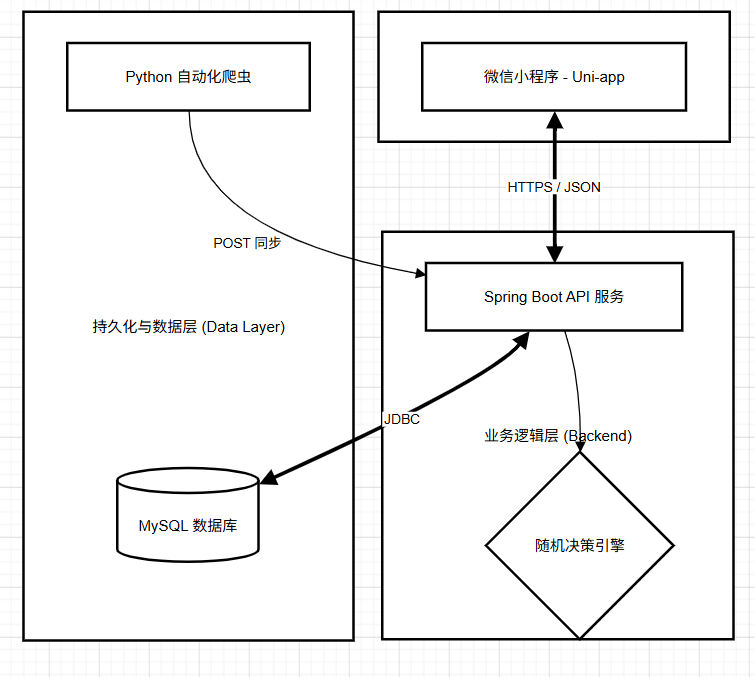
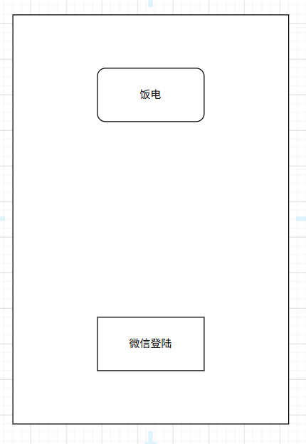
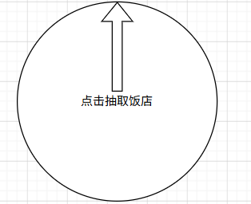
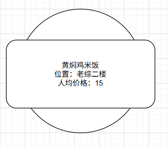

**饭电项目**

**概要设计说明书**

变更记录

**版本号**

**修改点说明**

**变更日期**

**变更人**

**审批人**

V1.0

创建

2026.4.19

Fennel

修改点说明的内容有如下几种：创建、修改（+修改说明）、删除（+删除说明）

**目录**

[1	前言	1](#_Toc227526331)

[1.1	文档目的	1](#_Toc227526332)

[1.2	背景	1](#_Toc227526333)

[1.3	文档范围	1](#_Toc227526334)

[1.4	读者对象	1](#_Toc227526335)

[1.5	参考文档	1](#_Toc227526336)

[1.6	术语与缩写解释	2](#_Toc227526337)

[2	总体设计	2](#_Toc227526338)

[2.1	系统描述	2](#_Toc227526339)

[2.1.1	系统概述	2](#_Toc227526340)

[2.1.2	运行环境	2](#_Toc227526341)

[2.1.3	数据管理要求	3](#_Toc227526342)

[2.1.4	故障处理要求	3](#_Toc227526343)

[2.1.5	其他要求	3](#_Toc227526344)

[2.2	总体设计说明	3](#_Toc227526345)

[2.2.1	基本设计概述	3](#_Toc227526346)

[2.2.2	设计思想	4](#_Toc227526347)

[2.2.3	系统总体结构	4](#_Toc227526348)

[2.2.4	处理流程	5](#_Toc227526349)

[3	接口设计	5](#_Toc227526350)

[3.1	外部接口	5](#_Toc227526351)

[3.2	内部接口	5](#_Toc227526352)

[3.2.1	用户认证接口 (Login API)	5](#_Toc227526353)

[3.2.2	随机决策接口 (Random Food API)	5](#_Toc227526354)

[3.2.3	数据同步接口 (Data Sync API)	6](#_Toc227526355)

[4	系统结构设计	6](#_Toc227526356)

[4.1	用户认证模块	6](#_Toc227526357)

[4.1.1	功能A：微信授权登录	6](#_Toc227526358)

[4.1.2	功能B：用户信息维护	7](#_Toc227526359)

[4.2	智能决策模块	7](#_Toc227526360)

[4.2.1	功能C：随机抽选逻辑	7](#_Toc227526361)

[4.2.2	功能D：结果渲染与交互	7](#_Toc227526362)

[4.3	模块 3：后台自动化服务模块	8](#_Toc227526363)

[4.3.1	功能 E：爬虫采集	8](#_Toc227526364)

[4.3.2	功能 F：数据批量入库	8](#_Toc227526365)

[5	系统数据结构	8](#_Toc227526366)

[5.1	逻辑结构设计要点	8](#_Toc227526367)

[5.1.1	实体关系转换规则	8](#_Toc227526368)

[5.1.2	核心关系模式 (数据表设计)	9](#_Toc227526369)

[5.2	数据结构与模块的关系	9](#_Toc227526370)

[6	运行设计	9](#_Toc227526371)

[6.1	运行模块的组合	9](#_Toc227526372)

[6.2	运行控制	10](#_Toc227526373)

[6.3	运行时间	10](#_Toc227526374)

[7	系统错误处理机制	10](#_Toc227526375)

[7.1.1	错误类型和处理方法	10](#_Toc227526376)

[7.1.2	恢复与可靠性设计	11](#_Toc227526377)

# 前言

## 文档目的

文档编写目的是为了阐述饭电系统的概要设计。概要设计说明书是为了说明整个饭电系统的体系架构，以及需求用例的各个功能点在架构中的体现，为系统的详细设计人员进行详细设计时的输入参考文档。本说明书的预期读者为系统设计人员、系统开发人员和项目评审人员。

## 背景

1.项目名称：饭电 

2.项目背景：针对大学生群体在日常生活中面临的“选择困难症”这一普遍痛点，本项目开发一款极简的美食随机决策小程序。

3.建设目标：通过微信小程序端提供大转盘随机抽选功能，利用 Java 后端支撑业务逻辑，并通过 Python 爬虫实现校园周边美食数据的自动化采集与更新。

## 文档范围

1、产品范围：根据《需求规格说明书》，本设计文档涵盖了用户认证（微信登录）、智能决策（随机抽选）以及后台数据自动化同步三大核心模块。

2、涉及到的干系人有：项目开发小组（组长、开发成员）、指导老师。 

## 读者对象

1.开发人员（前端、后端、爬虫）：据此明确系统架构，指导具体的代码实现与模块对接。 

2.项目评审人员：据此评估系统设计的合理性、可行性及技术规范性。

3.测试人员：据此制定集成测试与系统测试计划。

## 参考文档

1. 《饭电项目需求规格说明书 v1.0》

2. 微信小程序开发文档 (Official Documentation) 

3. 阿里巴巴 Java 开发手册

## 术语与缩写解释

**术语或缩略语**

**解释**

OpenID

微信用户的唯一标识，用于在本系统中识别用户身份。

MVP

最小可行性产品 (Minimum Viable Product)，指用最低成本实现核心功能的版本。

Uni-app

本项目使用的前端框架，用于开发微信小程序

Spring Boot

本项目使用的后端框架，用于构建 RESTful API。

DDL

数据定义语言 (Data Definition Language)，如建表语句

# 总体设计

## 系统描述

### 系统概述

饭电系统采用前后端分离的架构模式。

系统由三个核心子系统组成： 

1. 小程序端 (Frontend)：基于 Uni-app 开发，负责用户交互、微信登录调用及随机动画展示。

2. 业务服务端 (Backend)：基于 Spring Boot 开发，负责提供用户鉴权、随机算法逻辑及数据入库 API。 

3. 自动化采集端 (Data Layer)：基于 Python 编写，负责从校园周边平台爬取美食数据。

### 运行环境

对本平台所赖于运行的硬件、软件环境的描述。

- 客户端：微信开发者工具或支持微信小程序的移动终端。
- 服务端：操作系统：Linux (如 Ubuntu 20.04) 或 Windows Server 2022。
- 运行容器：JDK 1.8+。
- 数据库：MySQL 8.0。协议支持：HTTPS（前端通信强制要求）、HTTP（爬虫推送使用）。

### 数据管理要求

- 数据一致性：菜品信息在更新时应采用“存在即更新，不存在即插入”的逻辑，避免冗余。
- 数据安全性：用户身份标识（OpenID）在传输过程中需加密，后端禁止泄露用户隐私。
- 备份要求：数据库需定期执行物理或逻辑备份，防止数据丢失。

### 故障处理要求

- 网络异常：若小程序无法连接服务器，需弹出友好提示并允许用户重新加载。
- 数据真空：当数据库无可用菜品时，抽选接口应返回特定错误码，前端展示提示信息。
- 爬虫失效：若目标网站改版导致爬取失败，系统需保留现有存量数据，并向管理员发送预警。

### 其他要求

先进性：采用先进成熟的技术，确保系统的先进性、经济性和实用性。

安全可靠：提供的应用框架及平台本身提供应用安全保证，并可以和第三方安全手段，如认证、加密、电子签名等进行集成。必须保证数据的安全性和保密性。对于基于平台开发的应用系统，只允许有权限的人员进行操作和浏览信息。必须有安全的手段来进行权限控制。

开放互连：系统应对各类业务系统、数据库系统、WEB信息等具有通用的或可定制的接口策略和连接方法。

规范性：开发过程控制、开发技术、系统编码、文档应规范化，并遵循相应的国内外标准。开发结束，需要提供必要的文档资料。

可靠性：保证系统的可靠运行和在升级过程中的方便快捷。

可扩充性：系统应当可以根据需求的变化，方便地进行功能的调整、增减，模块的升级和系统架构的逐步完善。

界面友好、操作方便：操作界面要直观、简单、贴近实际，操作过程应当尽量简化，符合实际过程。身份认证过程即要保证安全，也要尽量简化认证过程。

可维护性：系统维护应当简单。

## 总体设计说明

### 基本设计概述

本系统遵循“轻前端，稳后端”的设计原则。前端主要负责视图逻辑和动画表现，核心业务逻辑（如随机种子生成、用户注册）均下沉至后端处理，以保证系统的可扩展性和数据安全性。

### 设计思想

- 模块化设计：系统各功能模块（登录、抽选、爬虫）之间保持低耦合。 
- 无状态化：由于采用微信 OpenID 认证，后端服务尽量保持无状态，便于后续横向扩展。 
- 极简原则 (MVP)：优先实现核心业务流，舍弃非核心功能以提升系统响应速度。

### 系统总体结构

- **处理流程**

系统的核心处理流程分为数据流和业务流： 

1. 数据流：Python 爬虫 -> JSON 封装 -> Java 接口 -> MySQL 存储。

2. 业务流：用户 -> 微信授权 -> Java 获取 ID -> 点击抽选 -> 后端随机返回 -> 前端展示。

# 接口设计

## 外部接口

本系统主要涉及与微信开放平台的外部通信。

 微信登录授权接口：

   接口说明：通过前端获取的临时 js_code 向微信服务器换取用户唯一标识 OpenID。

   调用方式：HTTPS GET

   第三方地址：https://api.weixin.qq.com/sns/jscode2session

   输入参数：appid, secret, js_code, grant_type。

   输出结果：包含 openid 和 session_key 的 JSON 数据包。

## 内部接口

### 用户认证接口 (Login API)

功能描述：接收前端传来的 code，完成用户注册或登录状态返回。

接口路径：POST /api/user/login

输入格式：{ "code": "STRING" }

输出格式： json {

    "code": 200, 

"msg": "登录成功", 

"data": 

{ 

"openid": "USER_OPENID_STRING" 

}

 }

### 随机决策接口 (Random Food API)

功能描述：从数据库中随机抽取一条菜品信息并返回。 

接口路径：GET /api/food/random

请求头：需携带 Authorization: OPENID 

输出格式：json {

 "code": 200, 

"data": 

{ 

"name": "二楼黄焖鸡", 

"price": 15.0, 

"canteen": "教一食堂", 

"window": "12号窗口"

 }

 }

### 数据同步接口 (Data Sync API)

功能描述：接收 Python 爬虫推送的批量菜品数据。

接口路径：POST /api/admin/sync 

安全验证：Header 需携带预设的 Sync-Key。

输入格式：json [

 { "name": "菜品名",

    "price": 10.5, 

"canteen": "食堂名",

     "window": "窗口号" }, ]

# 系统结构设计

## 用户认证模块

该模块负责管理用户身份，是系统安全访问的基础。

### 功能A：微信授权登录

- **界面原型**

 

- **功能说明：**

- **调用微信原生登录接口获取 code。**
- **后端通过 code 向微信服务器换取 OpenID。**
- **实现“静默登录”，即用户无需输入账号密码，直接通过微信身份识别。**

### 功能B：用户信息维护

- **界面原型：静默处理，无显示界面**
- **实现功能：**

- **后端接收到 OpenID 后，自动检索数据库：若为新用户则执行插入，若为老用户则更新最后登录时间。**

## 智能决策模块

该模块是系统的核心业务模块，负责提供“抽选”玩法的逻辑实现。

### 功能C：随机抽选逻辑

- **界面原型**

- **功能说明**

- **前端触发抽选后，向后端发起 GET 请求。 ***
- **后端连接数据库，通过随机算法选取一条菜品记录。 ***
- **返回结果包含：菜品名称、价格、所属食堂、档口位置。**

### 功能D：结果渲染与交互

- **界面原型**

- **功能说明**

- **前端接收到数据后，配合 CSS3 动画控制转盘停止，并弹出结果详情卡片。**

## 模块 3：后台自动化服务模块

该模块负责支撑系统的数据来源，确保决策池的丰富性。

### 功能 E：爬虫采集

- 界面原型：本地运行脚本。
- 功能说明：Python 脚本自动化抓取校园周边美食数据并进行清洗。

### 功能 F：数据批量入库 

1.界面原型：后端 API。 

2.功能说明： Java 后端校验爬虫推送的 Secret 秘钥，通过后执行批量入库/更新操作。

# 系统数据结构

## 逻辑结构设计要点

本系统采用 MySQL 8.0 关系型数据库。根据需求分析阶段的实体关系，我们将 E-R 图转换为以下逻辑关系模式。

### 实体关系转换规则

1.用户实体：独立转换为关系模式，以微信 OpenID 作为主键。 

2.菜品实体：独立转换为关系模式，记录校园各食堂的详细菜品信息。

3.联系处理：用户与菜品之间存在“抽选”这种多对多的动态联系，在极简版设计中，我们通过在用户表记录最后抽选时间，并在逻辑层实现随机匹配。

### 核心关系模式 (数据表设计)

1. 用户表 (t_user) 

- openid (VARCHAR, PK): 微信用户唯一标识。 
- nickname (VARCHAR): 用户微信昵称。
- create_time (DATETIME): 账号创建时间。
- last_login_time (DATETIME): 最后登录/抽选时间。

- 菜品表 (t_food)

- id (INT, PK, AI): 菜品自增主键。
- food_name (VARCHAR): 菜品名称。
- price (DECIMAL): 价格（元）。 
- canteen_name (VARCHAR): 食堂名称（如：一食堂、二食堂）。 
- window_no (VARCHAR): 档口/窗口编号。
- sync_time (DATETIME): 爬虫最后同步时间。

## 数据结构与模块的关系

物理数据结构与系统模块的交互关系如下：

1.用户认证模块与t_user

- 登录时，模块根据 openid 查询用户是否存在，执行 SELECT 或 INSERT 操作。 

2.智能决策模块 与t_food：

- 抽选时，模块执行随机读取操作：SELECT * FROM t_food ORDER BY RAND() LIMIT 1

3. 后台自动化服务 与 t_food：

- Python 爬虫推送数据时，模块执行批量 REPLACE INTO 或 INSERT ... ON DUPLICATE KEY UPDATE 操作，保持数据池最新。

# 运行设计

## 运行模块的组合

系统的运行由用户交互触发，形成闭环的模块联动：

- 登录组合：前端启动时触发“用户认证模块”，接收数据并调用“微信授权接口”获取身份，成功后激活“智能决策模块”。
- 决策组合：用户在首页点击抽选，触发“智能决策模块”调用数据库查询，数据返回后由“前端渲染模块”组合动画进行展示。
- 同步组合：服务器端处于被动监听状态，“后台自动化服务”通过 HTTP 协议将 Python 采集的数据批量推送到后端 API，触发数据库更新操作。

## 运行控制

运行控制严格遵循前后端分离的异步调用关系：

- 请求控制：前端在发起抽选请求后立即锁定按钮（Loading 状态），防止用户在一次运行周期内进行重复、无效的操作。
- 逻辑控制：后端 Java 服务采用事务控制（Transaction），确保在接收爬虫大数据量推送时，要么完整更新，要么全部回滚，保证数据的原子性。
- 异常控制：当网络连接超时或数据库无响应时，系统将通过全局异常处理器捕捉错误，并将运行控制权交还给前端错误提示模块。

## 运行时间

为了保证校园高峰期的用户体验，对系统运行时间做出如下约束：

- 响应时间：核心抽选接口 /api/food/random 在正常网络环境下，后端处理时间（含数据库访问）应小于 100ms，系统总响应时间不应超过 1s。
- 动画时长：为模拟“抽选仪式感”，前端转盘旋转动画运行时间固定为 1.5s - 2.0s，以确保视觉体验优于直接弹出结果。 
- 数据同步：单次批量数据同步任务（50条数据）应在 5s内完成，且不应阻塞用户的查询操作。

# 系统错误处理机制

### 错误类型和处理方法

**出错类型**

**详情描述**

**处理方法**

客户端输入/请求错误

用户在未登录状态下强制触发抽选，或请求非法参数。

前端增加路由守卫，在发送请求前校验 Token（OpenID）。后端返回 401 Unauthorized 状态码，由前端弹出提示框引导用户重新登录。

网络传输超时/中断

手机校园网信号不佳，导致 API 请求长时间无响应。

前端设置请求超时时间（Timeout = 5s）。若超时，前端停止动画，并展示“网络走丢了，请重试”的 Toast 提示，避免按钮一直处于锁定状态。

后端逻辑/数据库异常

数据库连接池满或 SQL 执行报错。

后端采用全局异常拦截器（@RestControllerAdvice），将底层报错封装为友好的 JSON 错误信息（如：{ "code": 500, "msg": "食堂大厨忙碌中..." }），防止将底层代码堆栈暴露给用户。

外部服务（微信）异常。

微信登录接口无法换取 OpenID。

系统自动重试一次；若依旧失败，前端提示“微信登录异常”，并提供“以游客身份进入”的降级方案（但不保存抽选记录）

数据更新异常

Python 爬虫推送的数据格式不正确。

Java 后端接口在入库前进行 DTO 参数校验。对于格式错误的数据直接抛弃，并返回具体的错误字段信息，同时记录日志文件以便 Python 组后续复盘。

### 恢复与可靠性设计

- 数据备份机制：定期使用 mysqldump 对 MySQL 中的菜品数据和用户信息进行备份，防止因服务器硬件损坏导致的数据丢失。
- 状态重置技术：当小程序检测到严重运行错误时，用户可以通过“下拉刷新”或重新进入小程序的操作，触发系统状态的初始化，清除失效的缓存并重新建立连接。
- 日志追踪：服务端将所有 ERROR 级别的报错记录在 /logs/error.log 文件中，包含时间戳和错误 ID，方便开发小组在维护阶段准确定位故障点。